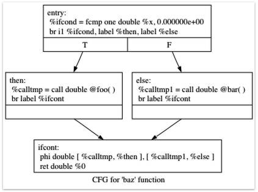

# 5. 扩展功能：控制流

## 5.1 介绍

欢迎阅读“使用 LLVM 实现语言”教程的第 5 章。第 1-4 部分描述了简单 Kaleidoscope 语言的实现，包括对生成 LLVM IR 的支持，随后是优化和 JIT 编译器。不幸的是，如前所述，Kaleidoscope 几乎毫无用处：除了调用和返回之外，它没有控制流。这意味着您不能在代码中有条件分支，从而大大限制了它的功能。在“构建编译器”的这一集中，我们将扩展 Kaleidoscope 使其具有 if/then/else 表达式和一个简单的“for”循环。

## 5.2 If / Then / Else

扩展 Kaleidoscope 以支持 if/then/else 非常简单。它基本上需要为词法分析器、解析器、AST 和 LLVM 代码发射器添加对这个“新”概念的支持。这个例子很好，因为它显示了随着时间的推移“发展”一门语言是多么容易，随着新想法的发现逐渐扩展它。

在我们继续“如何”添加此扩展之前，让我们谈谈我们想要的“什么”。基本思想是我们希望能够写出这样的东西：

``` cpp
def fib(x)
  if x < 3 then
    1
  else
    fib(x-1)+fib(x-2);
```

在 Kaleidoscope 中，每个构造都是一个表达式：没有语句。因此，if/then/else 表达式需要像其他任何表达式一样返回一个值。由于我们主要使用函数形式，我们将让它评估其条件，然后根据条件的解决方式返回“then”或“else”值。这与 C 中的“?:”表达式非常相似。

if/then/else 表达式的语义是它将条件计算为布尔相等值：0.0 被认为是假的，其他一切都被认为是真的。如果条件为真，则计算并返回第一个子表达式，如果条件为假，则计算并返回第二个子表达式。由于 Kaleidoscope 允许副作用，因此确定此行为很重要。

现在我们知道我们“想要什么”，让我们把它分解成它的组成部分。

### 5.2.1 If/Then/Else 的词法分析器扩展

词法分析器扩展很简单。首先，我们为相关标记添加新的枚举值：

``` cpp
// control
tok_if = -6,
tok_then = -7,
tok_else = -8,
```

一旦我们有了它，我们就会在词法分析器中识别出新的关键字。这是非常简单的事情：

``` cpp
        ...
        if (IdentifierStr == "def")
          return tok_def;
        if (IdentifierStr == "extern")
          return tok_extern;
        if (IdentifierStr == "if")
          return tok_if;
        if (IdentifierStr == "then")
          return tok_then;
        if (IdentifierStr == "else")
          return tok_else;
        return tok_identifier;
```

### 5.2.2 If/Then/Else 的 AST 扩展

为了表示新表达式，我们为其添加了一个新的 AST 节点：

``` cpp
    /// IfExprAST - Expression class for if/then/else.
    class IfExprAST : public ExprAST {
      std::unique_ptr<ExprAST> Cond, Then, Else;

    public:
      IfExprAST(std::unique_ptr<ExprAST> Cond, std::unique_ptr<ExprAST> Then,
                std::unique_ptr<ExprAST> Else)
        : Cond(std::move(Cond)), Then(std::move(Then)), Else(std::move(Else)) {}

      Value *codegen() override;
    };
```

AST 节点只有指向各种子表达式的指针。

### 5.2.3 If/Then/Else 的解析器扩展

现在我们有了来自词法分析器的相关标记，并且有了要构建的 AST 节点，我们的解析逻辑就相对简单了。首先我们定义一个新的解析函数：

``` cpp
    /// ifexpr ::= 'if' expression 'then' expression 'else' expression
    static std::unique_ptr<ExprAST> ParseIfExpr() {
      getNextToken();  // eat the if.

      // condition.
      auto Cond = ParseExpression();
      if (!Cond)
        return nullptr;

      if (CurTok != tok_then)
        return LogError("expected then");
      getNextToken();  // eat the then

      auto Then = ParseExpression();
      if (!Then)
        return nullptr;

      if (CurTok != tok_else)
        return LogError("expected else");

      getNextToken();

      auto Else = ParseExpression();
      if (!Else)
        return nullptr;

      return std::make_unique<IfExprAST>(std::move(Cond), std::move(Then),
                                          std::move(Else));
    }
```

接下来我们将它连接起来作为一个主要表达式：

``` cpp
    static std::unique_ptr<ExprAST> ParsePrimary() {
      switch (CurTok) {
      default:
        return LogError("unknown token when expecting an expression");
      case tok_identifier:
        return ParseIdentifierExpr();
      case tok_number:
        return ParseNumberExpr();
      case '(':
        return ParseParenExpr();
      case tok_if:
        return ParseIfExpr();
      }
    }
```

### 5.2.4 用于 If/Then/Else 的 LLVM IR

现在我们已经解析和构建 AST，最后一部分是添加 LLVM 代码生成支持。这是 if/then/else 示例中最有趣的部分，因为这是它开始引入新概念的地方。上面的所有代码已经在前面的章节中进行了详尽的描述。

为了激发我们想要生成的代码，让我们看一个简单的例子。假设：

``` cpp
    extern foo();
    extern bar();
    def baz(x) if x then foo() else bar();
```

如果您禁用优化，您将（很快）从 Kaleidoscope 获得的代码如下所示：

``` llvm
    declare double @foo()

    declare double @bar()

    define double @baz(double %x) {
    entry:
      %ifcond = fcmp one double %x, 0.000000e+00
      br i1 %ifcond, label %then, label %else

    then:       ; preds = %entry
      %calltmp = call double @foo()
      br label %ifcont

    else:       ; preds = %entry
      %calltmp1 = call double @bar()
      br label %ifcont

    ifcont:     ; preds = %else, %then
      %iftmp = phi double [ %calltmp, %then ], [ %calltmp1, %else ]
      ret double %iftmp
    }
```

要可视化控制流图，您可以使用 LLVM “[opt](https://llvm.org/cmds/opt.html)” 工具的一个漂亮功能。如果将此 LLVM IR 放入 “t.ll” 并运行 “`llvm-as < t.ll | opt -passes=view-cfg`”，会弹出一个窗口，你会看到这个图：


另一种方法是调用 ```F->viewCFG()``` 或 ```F->viewCFGOnly()```（其中 F 是一个 ```Function*```），方法是将实际调用插入代码并重新编译，或者在调试器。 LLVM 有许多用于可视化各种图形的不错的功能。

回到生成的代码，它相当简单：入口块评估条件表达式（在我们的例子中为“x”）并使用 ```fcmp one``` 指令将结果与 0.0 进行比较（'one' 是“Ordered and Not Equal”）。根据这个表达式的结果，代码跳转到“then” 或 “else” 块，其中包含真/假情况的表达式。

一旦 then/else 块执行完毕，它们都会分支回 “ifcont” 块以执行 if/then/else 之后发生的代码。在这种情况下，唯一要做的就是返回函数的调用者。那么问题就变成了：代码如何知道要返回哪个表达式？

这个问题的答案涉及一个重要的 SSA 操作：[Phi 操作](http://en.wikipedia.org/wiki/Static_single_assignment_form)。如果您不熟悉 SSA，[维基百科文章](http://en.wikipedia.org/wiki/Static_single_assignment_form)是一个很好的介绍，您最喜欢的搜索引擎上还有各种其他介绍。**简短的版本**是 Phi 操作的“执行”需要“记住”哪个块控制来自。 Phi 运算采用对应于输入控制块的值。在这种情况下，如果控制来自“then”块，它会获得“calltmp”的值。如果控制来自“else”块，它会获得“calltmp1”的值。

在这一点上，你可能开始想“哦不！这意味着我简单而优雅的前端必须开始生成 SSA 表单才能使用 LLVM！”。幸运的是，情况并非如此，我们强烈建议不要在前端实施 SSA 构造算法，除非有充分的理由这样做。在实践中，有两种值在为可能需要 Phi 节点的普通命令式编程语言编写的代码中浮动：

1. 涉及用户变量的代码：``x = 1; x = x + 1;``
2. AST 结构中隐含的值，例如本例中的 Phi 节点。
   
在本教程的第 7 章（“可变变量”）中，我们将深入讨论 #1。现在，请相信我，您不需要构建 SSA 来处理这种情况。对于 #2，您可以选择使用我们将为 #1 描述的技术，或者如果方便的话，您可以直接插入 Phi 节点。在这种情况下，生成 Phi 节点确实很容易，所以我们选择直接生成。

好的，动机和概述已经足够了，让我们生成代码吧！

### 5.2.5 If/Then/Else 的代码生成

为了为此生成代码，我们为 ```IfExprAST``` 实现代码生成方法：

``` cpp
    Value *IfExprAST::codegen() {
      Value *CondV = Cond->codegen();
      if (!CondV)
        return nullptr;

      // Convert condition to a bool by comparing non-equal to 0.0.
      CondV = Builder.CreateFCmpONE(
          CondV, ConstantFP::get(TheContext, APFloat(0.0)), "ifcond");
```

这段代码很简单，与我们之前看到的类似。我们发出条件的表达式，然后将该值与零进行比较以获得真值作为 1 位（布尔）值。

``` cpp
      Function *TheFunction = Builder.GetInsertBlock()->getParent();

      // Create blocks for the then and else cases.  Insert the 'then' block at the
      // end of the function.
      BasicBlock *ThenBB =
          BasicBlock::Create(TheContext, "then", TheFunction);
      BasicBlock *ElseBB = BasicBlock::Create(TheContext, "else");
      BasicBlock *MergeBB = BasicBlock::Create(TheContext, "ifcont");

      Builder.CreateCondBr(CondV, ThenBB, ElseBB);
```

此代码创建与 if/then/else 语句相关的基本块，并直接对应于上面示例中的块。第一行获取正在构建的当前 Function 对象。它通过向构建器询问当前 BasicBlock 并向该块询问其“父级”（它当前嵌入的功能）来获得此信息。

一旦有了它，它就会创建三个块。请注意，它将 “TheFunction” 传递给 “then” 块的构造函数。这会导致构造函数自动将新块插入到指定函数的末尾。其他两个块已创建，但尚未插入到函数中。

创建块后，我们可以发出在它们之间进行选择的条件分支。请注意，创建新块不会隐式影响 IRBuilder，因此它仍会插入到条件进入的块中。另请注意，它正在创建 “then” 块和 “else” 块的分支，即使 “else” 块尚未插入函数中。这没问题：这是 LLVM 支持前向引用的标准方式。

``` cpp
      // Emit then value.
      Builder.SetInsertPoint(ThenBB);

      Value *ThenV = Then->codegen();
      if (!ThenV)
        return nullptr;

      Builder.CreateBr(MergeBB);
      // Codegen of 'Then' can change the current block, update ThenBB for the PHI.
      ThenBB = Builder.GetInsertBlock();
```

插入条件分支后，我们移动构建器以开始插入到“then”块中。严格来说，此调用将插入点移动到指定块的末尾。然而，由于“then”块是空的，它也从块的开头插入开始。 :)

一旦设置了插入点，我们就会递归地从 AST 中生成“then”表达式。为了完成“then”块，我们创建了一个无条件分支到合并块。 LLVM IR 的一个有趣（且非常重要）的方面是它要求所有基本块都以控制流指令（如返回或分支）“终止”。这意味着所有控制流，包括失败，都必须在 LLVM IR 中明确说明。如果违反此规则，验证器将发出错误。

这里的最后一行非常微妙，但非常重要。基本问题是，当我们在合并块中创建 Phi 节点时，我们需要设置指示 Phi 将如何工作的块/值对。重要的是，Phi 节点希望在 CFG 中为块的每个前身都有一个条目。那么，为什么当我们将它设置为上面 5 行的 ThenBB 时，我们得到的是当前块？问题在于，“Then”表达式本身实际上可能会更改 Builder 发出的块，例如，如果它包含嵌套的“if/then/else”表达式。因为递归调用 ```codegen()``` 可能会任意更改当前块的概念，我们需要为将设置 Phi 节点的代码获取最新值。

``` cpp
      // Emit else block.
      TheFunction->getBasicBlockList().push_back(ElseBB);
      Builder.SetInsertPoint(ElseBB);

      Value *ElseV = Else->codegen();
      if (!ElseV)
        return nullptr;

      Builder.CreateBr(MergeBB);
      // codegen of 'Else' can change the current block, update ElseBB for the PHI.
      ElseBB = Builder.GetInsertBlock();
```

“else” 块的代码生成与“then”块的代码生成基本相同。唯一显着的区别是第一行，它向函数添加了 “else” 块。回想一下，之前创建了 “else” 块，但没有添加到函数中。现在已经发出了 “then” 和 “else” 块，我们可以完成合并代码：

``` cpp
      // Emit merge block.
      TheFunction->getBasicBlockList().push_back(MergeBB);
      Builder.SetInsertPoint(MergeBB);
      PHINode *PN =
        Builder.CreatePHI(Type::getDoubleTy(TheContext), 2, "iftmp");

      PN->addIncoming(ThenV, ThenBB);
      PN->addIncoming(ElseV, ElseBB);
      return PN;
    }
```

这里的前两行现在很熟悉：第一行将“合并”块添加到 Function 对象（它以前是浮动的，就像上面的 else 块一样）。第二个更改插入点，以便新创建的代码将进入“合并”块。完成后，我们需要创建 PHI 节点并为 PHI 设置块/值对。

最后，CodeGen 函数返回 phi 节点作为 if/then/else 表达式计算的值。在我们上面的示例中，此返回值将提供给顶级函数的代码，该函数将创建返回指令。

总的来说，我们现在可以在 Kaleidoscope 中执行条件代码。通过这个扩展，Kaleidoscope 是一种相当完整的语言，可以计算各种各样的数字函数。接下来我们将添加另一个在非函数式语言中很熟悉的有用表达式……

## 5.3 'for' 循环表达式

既然我们知道如何向语言添加基本的控制流结构，我们就有了添加更强大功能的工具。让我们添加一些更积极的东西，一个 “for” 表达式：

``` cpp
     extern putchard(char);
     def printstar(n)
       for i = 1, i < n, 1.0 in
         putchard(42);  # ascii 42 = '*'

     # print 100 '*' characters
     printstar(100);
```

该表达式定义了一个新变量（在本例中为“i”），它从起始值迭代，条件（在本例中为“i < n”）为真，递增一个可选步长值（在本例中为“1.0”） ).如果省略步长值，则默认为 1.0。当循环为真时，它会执行其主体表达式。因为我们没有更好的返回值，所以我们将循环定义为始终返回 0.0。将来当我们有可变变量时，它会变得更有用。

和以前一样，让我们​​谈谈我们需要对 Kaleidoscope 进行哪些更改来支持它。

### 5.3.1 'for' 循环的词法分析器扩展

词法分析器扩展与 if/then/else 是同一类东西：

``` cpp
      ... in enum Token ...
      // control
      tok_if = -6, tok_then = -7, tok_else = -8,
      tok_for = -9, tok_in = -10

      ... in gettok ...
      if (IdentifierStr == "def")
        return tok_def;
      if (IdentifierStr == "extern")
        return tok_extern;
      if (IdentifierStr == "if")
        return tok_if;
      if (IdentifierStr == "then")
        return tok_then;
      if (IdentifierStr == "else")
        return tok_else;
      if (IdentifierStr == "for")
        return tok_for;
      if (IdentifierStr == "in")
        return tok_in;
      return tok_identifier;
```

### 5.3.2 'for' 循环的 AST 扩展

AST 节点同样简单。它基本上归结为捕获节点中的变量名称和组成表达式。

``` cpp
    /// ForExprAST - Expression class for for/in.
    class ForExprAST : public ExprAST {
      std::string VarName;
      std::unique_ptr<ExprAST> Start, End, Step, Body;

    public:
      ForExprAST(const std::string &VarName, std::unique_ptr<ExprAST> Start,
                 std::unique_ptr<ExprAST> End, std::unique_ptr<ExprAST> Step,
                 std::unique_ptr<ExprAST> Body)
        : VarName(VarName), Start(std::move(Start)), End(std::move(End)),
          Step(std::move(Step)), Body(std::move(Body)) {}

      Value *codegen() override;
    };
```

### 'for' 循环的解析器扩展

解析器代码也相当标准。这里唯一有趣的是处理可选步长值。解析器代码通过检查第二个逗号是否存在来处理它。如果不是，它将 AST 节点中的步长值设置为 null：

``` cpp
    /// forexpr ::= 'for' identifier '=' expr ',' expr (',' expr)? 'in' expression
    static std::unique_ptr<ExprAST> ParseForExpr() {
      getNextToken();  // eat the for.

      if (CurTok != tok_identifier)
        return LogError("expected identifier after for");

      std::string IdName = IdentifierStr;
      getNextToken();  // eat identifier.

      if (CurTok != '=')
        return LogError("expected '=' after for");
      getNextToken();  // eat '='.


      auto Start = ParseExpression();
      if (!Start)
        return nullptr;
      if (CurTok != ',')
        return LogError("expected ',' after for start value");
      getNextToken();

      auto End = ParseExpression();
      if (!End)
        return nullptr;

      // The step value is optional.
      std::unique_ptr<ExprAST> Step;
      if (CurTok == ',') {
        getNextToken();
        Step = ParseExpression();
        if (!Step)
          return nullptr;
      }

      if (CurTok != tok_in)
        return LogError("expected 'in' after for");
      getNextToken();  // eat 'in'.

      auto Body = ParseExpression();
      if (!Body)
        return nullptr;

      return std::make_unique<ForExprAST>(IdName, std::move(Start),
                                           std::move(End), std::move(Step),
                                           std::move(Body));
    }
```

我们再次将其连接为主要表达式：

``` cpp
    static std::unique_ptr<ExprAST> ParsePrimary() {
      switch (CurTok) {
      default:
        return LogError("unknown token when expecting an expression");
      case tok_identifier:
        return ParseIdentifierExpr();
      case tok_number:
        return ParseNumberExpr();
      case '(':
        return ParseParenExpr();
      case tok_if:
        return ParseIfExpr();
      case tok_for:
        return ParseForExpr();
      }
    }
```

### 5.3.4 用于 'for' 循环的 LLVM IR

现在我们进入了好的部分：我们要为这个东西生成的 LLVM IR。通过上面的简单示例，我们得到了这个 LLVM IR（请注意，为清楚起见，此转储是在禁用优化的情况下生成的）：

``` llvm
    declare double @putchard(double)

    define double @printstar(double %n) {
    entry:
      ; initial value = 1.0 (inlined into phi)
      br label %loop

    loop:       ; preds = %loop, %entry
      %i = phi double [ 1.000000e+00, %entry ], [ %nextvar, %loop ]
      ; body
      %calltmp = call double @putchard(double 4.200000e+01)
      ; increment
      %nextvar = fadd double %i, 1.000000e+00

      ; termination test
      %cmptmp = fcmp ult double %i, %n
      %booltmp = uitofp i1 %cmptmp to double
      %loopcond = fcmp one double %booltmp, 0.000000e+00
      br i1 %loopcond, label %loop, label %afterloop

    afterloop:      ; preds = %loop
      ; loop always returns 0.0
      ret double 0.000000e+00
    }
```

这个循环包含我们之前看到的所有相同结构：一个 phi 节点、几个表达式和一些基本块。让我们看看这是如何组合在一起的。

### 5.3.5 'for' 循环的代码生成

codegen 的第一部分非常简单：我们只输出循环值的开始表达式：

``` cpp
    Value *ForExprAST::codegen() {
      // Emit the start code first, without 'variable' in scope.
      Value *StartVal = Start->codegen();
      if (!StartVal)
        return nullptr;
```

有了这个，下一步就是为循环体的开始设置 LLVM 基本块。在上面的例子中，整个循环体是一个块，但请记住，主体代码本身可以由多个块组成（例如，如果它包含一个 if/then/else 或一个 for/in 表达式）。

``` cpp 
      // Make the new basic block for the loop header, inserting after current
      // block.
      Function *TheFunction = Builder.GetInsertBlock()->getParent();
      BasicBlock *PreheaderBB = Builder.GetInsertBlock();
      BasicBlock *LoopBB =
          BasicBlock::Create(TheContext, "loop", TheFunction);

      // Insert an explicit fall through from the current block to the LoopBB.
      Builder.CreateBr(LoopBB);
```

这段代码类似于我们看到的 if/then/else。因为我们将需要它来创建 Phi 节点，所以我们记住了进入循环的块。一旦我们有了它，我们就会创建启动循环的实际块，并为两个块之间的失败创建一个无条件分支。

``` cpp
      // Start insertion in LoopBB.
      Builder.SetInsertPoint(LoopBB);

      // Start the PHI node with an entry for Start.
      PHINode *Variable = Builder.CreatePHI(Type::getDoubleTy(TheContext),
                                            2, VarName.c_str());
      Variable->addIncoming(StartVal, PreheaderBB);
```

现在已经设置了循环的“preheader”，我们切换到为循环体发出代码。首先，我们移动插入点并为循环归纳变量创建 PHI 节点。由于我们已经知道起始值的传入值，因此我们将其添加到 Phi 节点。请注意，Phi 最终会为后缘获得第二个值，但我们还不能设置它（因为它不存在！）。

``` cpp
      // Within the loop, the variable is defined equal to the PHI node.  If it
      // shadows an existing variable, we have to restore it, so save it now.
      Value *OldVal = NamedValues[VarName];
      NamedValues[VarName] = Variable;

      // Emit the body of the loop.  This, like any other expr, can change the
      // current BB.  Note that we ignore the value computed by the body, but don't
      // allow an error.
      if (!Body->codegen())
        return nullptr;
```

现在代码开始变得更有趣了。我们的“for”循环向符号表引入了一个新变量。这意味着我们的符号表现在可以包含函数参数或循环变量。为了处理这个问题，在我们编写循环体之前，我们将循环变量添加为其名称的当前值。请注意，外部作用域中可能存在同名变量。很容易使它成为一个错误（如果已经有 VarName 的条目，则发出错误并返回 null），但我们选择允许隐藏变量。为了正确处理这个问题，我们记住我们可能在 ```OldVal``` 中隐藏的值（如果没有隐藏变量，它将为 null）。

一旦将循环变量设置到符号表中，代码就会递归地生成 codegen 的主体。这允许主体使用循环变量：任何对它的引用都会自然地在符号表中找到它。

``` cpp
      // Emit the step value.
      Value *StepVal = nullptr;
      if (Step) {
        StepVal = Step->codegen();
        if (!StepVal)
          return nullptr;
      } else {
        // If not specified, use 1.0.
        StepVal = ConstantFP::get(TheContext, APFloat(1.0));
      }

      Value *NextVar = Builder.CreateFAdd(Variable, StepVal, "nextvar");
```

现在主体已发出，我们通过添加步长值来计算迭代变量的下一个值，如果不存在则为 1.0。```NextVar``` 将是循环下一次迭代时循环变量的值。

``` cpp
      // Compute the end condition.
      Value *EndCond = End->codegen();
      if (!EndCond)
        return nullptr;

      // Convert condition to a bool by comparing non-equal to 0.0.
      EndCond = Builder.CreateFCmpONE(
          EndCond, ConstantFP::get(TheContext, APFloat(0.0)), "loopcond");
```

最后，我们评估循环的退出值，以确定循环是否应该退出。这反映了 if/then/else 语句的条件评估。

``` cpp
      // Create the "after loop" block and insert it.
      BasicBlock *LoopEndBB = Builder.GetInsertBlock();
      BasicBlock *AfterBB =
          BasicBlock::Create(TheContext, "afterloop", TheFunction);

      // Insert the conditional branch into the end of LoopEndBB.
      Builder.CreateCondBr(EndCond, LoopBB, AfterBB);

      // Any new code will be inserted in AfterBB.
      Builder.SetInsertPoint(AfterBB);
```

循环体的代码完成后，我们只需要完成它的控制流程。此代码记住结束块（对于 phi 节点），然后为循环出口（“afterloop”）创建块。根据退出条件的值，它创建一个条件分支，在再次执行循环和退出循环之间进行选择。任何未来的代码都会在“afterloop”块中发出，因此它会为其设置插入位置。

``` cpp
      // Add a new entry to the PHI node for the backedge.
      Variable->addIncoming(NextVar, LoopEndBB);

      // Restore the unshadowed variable.
      if (OldVal)
        NamedValues[VarName] = OldVal;
      else
        NamedValues.erase(VarName);

      // for expr always returns 0.0.
      return Constant::getNullValue(Type::getDoubleTy(TheContext));
    }
```

最终代码处理各种清理：现在我们有了“NextVar”值，我们可以将传入值添加到循环 PHI 节点。之后，我们从符号表中删除循环变量，使其不在 for 循环之后的范围内。最后，for 循环的代码生成始终返回 0.0，因此这就是我们从 ```ForExprAST::codegen()``` 返回的值。

至此，我们结束了本教程的“向 Kaleidoscope 添加控制流”一章。在本章中，我们添加了两个控制流结构，并使用它们来激发 LLVM IR 的几个方面，这些方面对于前端实现者来说很重要。在我们传奇的下一章中，我们将变得更加疯狂，并将用户自定义的运算符添加到我们可怜的无辜语言中。

## 5.4 完整代码清单 

这是我们运行示例的完整代码清单，使用 if/then/else 和 for 表达式进行了增强。要构建此示例，请使用：

``` bash
    # Compile
    clang++ -g toy.cpp `llvm-config --cxxflags --ldflags --system-libs --libs core orcjit native` -O3 -o toy
    # Run
    ./toy
```